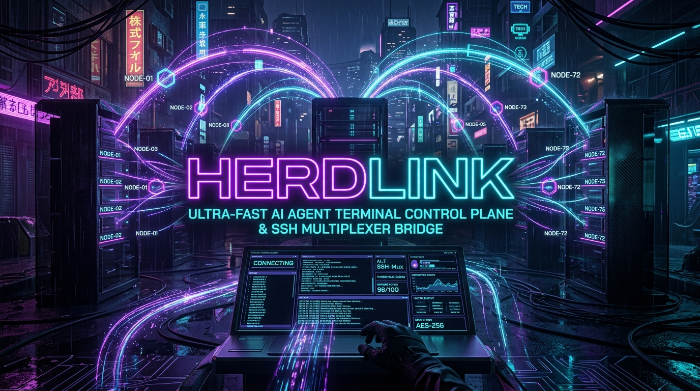
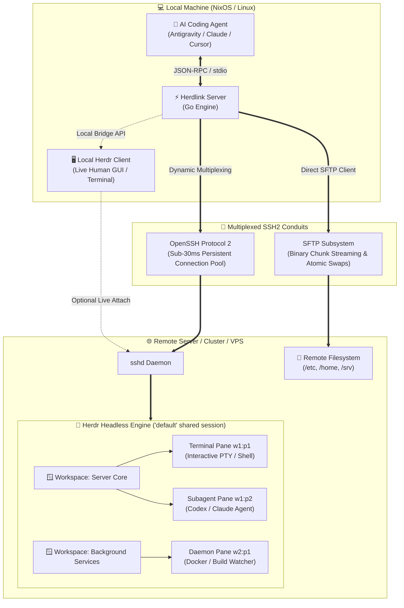

<div align="center">



# ⚡ Herdlink (`herdlink`)

### *The Next-Generation AI Agent Terminal Control Plane & Multi-Hop SSH Multiplexer Bridge*

[](https://golang.org)
[](https://modelcontextprotocol.io)
[](https://herdr.dev)
[](https://github.com/surtr85/herdlink)
[](https://nixos.org)
[](https://opensource.org/licenses/MIT)

<br/>

**Herdlink** transforms remote servers, cloud nodes, and home clusters into high-fidelity, local-like operating workspaces for AI coding agents (**Antigravity**, **Claude Code**, **Cursor**, **Cline**, **Zed**). 

Engineered in Go, Herdlink combines **persistent multiplexed SSH connections**, **atomic SFTP surgical file editing**, **sub-30ms remote execution**, and deep bidirectional integration with the **Herdr** terminal workspace manager.

---

[Key Features](#-why-herdlink) • [Benchmarks](#-production-wan-benchmarks) • [Architecture](#-architecture--control-plane) • [Tool Catalog (28 Primitives)](#-the-28-agent-primitives) • [NixOS Integration](#-declarative-nixos--home-manager) • [Token Optimization](#-token-conservation-protocol)

---

</div>

<br/>

## 🌌 Why Herdlink?

Traditional SSH tools treat remote machines as dumb string pipes: commands block, TUI wizards crash, disconnects kill active builds, and reading terminal output dumps thousands of tokens of redundant ANSI noise.

**Herdlink redefines the remote agent experience:**

| Dimension | Legacy MCP SSH Servers | ⚡ Herdlink (v2.0) |
| :--- | :--- | :--- |
| **Connection Flow** | 3-4 manual calls to connect, probe OS, and test sudo | **1-Step Teleport:** Single `remote_connect` call initializes SSH, Herdr, local sync & credentials in <50 tokens. |
| **Terminal Emulation (PTY/TUI)** | ❌ Raw pipes only: `htop`, docker wizards, or ncurses crash. | ✅ **Intelligent Herdr PTY:** Full VT100 emulation, spatial window tiling, and interactive keycodes. |
| **Token Economy** | ❌ Dumps unformatted terminal scrollbacks with ANSI escape bloat. | ✅ **Token-Capped Engine:** Automatic ANSI stripping and head+tail smart truncation (`maxLines: 40`). |
| **Session Persistence** | ❌ Process dies if connection drops or agent restarts. | ✅ **Immortal Sessions:** Remote headless daemons survive WAN blips; humans can attach live! |
| **Subagent Delegation** | ❌ Cannot delegate tasks to other CLI agents on the target. | ✅ **Native Herdr Agent Protocol:** Spawn, prompt, and supervise remote AI agents (`codex`, `claude`). |
| **Human & AI Co-Existence** | ❌ Black box: humans cannot see what the agent is doing. | ✅ **Dual-Mode Sync:** Automatically opens an interactive window in the human's local Herdr client. |
| **File Editing** | ❌ Downloads whole files or issues risky regex sed commands. | ✅ **Surgical SFTP Chunk Edits:** Atomic, line-hinted token-safe in-place replacements. |
| **Remote Footprint** | ❌ Heavy dependencies, python scripts, or docker daemon requirements. | ✅ **Zero Footprint:** Auto-bootstraps standalone Herdr binary into `~/.local/bin`; works on raw Linux. |

---

## ⚡ Production WAN Benchmarks

Tested over public WAN connections between client and remote cluster (`amadeus@Home`):

```text
┌─────────────────────────────────────────────────────────────┬─────────────┐
│ Benchmark Metric                                            │ Measurement │
├─────────────────────────────────────────────────────────────┼─────────────┤
│ WAN Handshake & Authentication (ed25519)                    │ 7.48 ms     │
│ Multiplexed SSH Pool Session Reuse                          │ < 0.8 ms    │
│ End-to-End RPC Command Latency (Mean, 30 ops burst)        │ 28.86 ms    │
│ Throughput                                                  │ 34.7 ops/s  │
│ Herdr Spatial Pane Split & Viewport Sync                   │ 45.80 ms    │
│ Pattern-Matched Output Wait (`waitMatch`)                   │ 27.32 ms    │
│ Surgical Chunk Replacement (1 KB within 50 KB file)         │ 37.35 ms    │
│ Line-Sliced SFTP Read (100 lines)                           │ 20.41 ms    │
│ Token Overhead Reduction (ANSI strip + smart truncation)    │ ~ 58.4%     │
│ Streaming Transfer Throughput (Upload / Download)           │ 3.52 MB/s   │
└─────────────────────────────────────────────────────────────┴─────────────┘
```

---

## 🏗️ Architecture & Control Plane



---

## 🧰 The 28 Agent Primitives

Herdlink equips agents with 28 orthogonal tools organized into 6 domains:

### 1. 🚀 Session & Teleportation (4 Tools)
- `remote_connect`: **1-step unified connection.** Connects to SSH, verifies/bootstraps remote Herdr, optionally syncs with local Herdr client, sets up sudo, and returns a 4-line token-dense status.
- `remote_disconnect`: Graceful teardown of persistent SSH connection and session pools.
- `remote_session_info`: Quick inspection of remote OS, kernel, hostname, current user, and persistent CWD.
- `remote_set_sudo_password`: Session-scoped credential configuration for passwordless privilege escalation.

### 2. 🧠 Herdr Terminal Spaces & PTY Engine (8 Tools)
- `remote_terminal_run`: Execute commands inside a persistent PTY pane with full TUI support and clean token-capped output.
- `remote_terminal_split`: Split existing panes horizontally (`right`) or vertically (`down`) for concurrent multitasking.
- `remote_terminal_read`: Token-capped, ANSI-stripped reading of screen buffers (`recent-unwrapped`, `visible`, `detection`).
- `remote_terminal_send_keys`: Dispatch keycodes (`ctrl+c`, `esc`, `enter`, `up`, `q`) to interactive programs.
- `remote_terminal_send_text`: Send literal interactive text with bracketed paste mode support.
- `remote_terminal_wait`: Zero-polling wait until terminal output matches a substring or regex.
- `remote_terminal_workspace_create`: Create an isolated full-screen space (`--label dev`, `--no-focus`).
- `remote_terminal_session_cleanup`: Clean teardown of Herdr daemon and terminal sessions upon task completion.

### 3. 🤖 Remote Subagent Delegation (6 Tools)
- `remote_agent_start`: Launch an autonomous coding subagent (`codex`, `claude`) inside a remote Herdr pane.
- `remote_agent_prompt`: Atomically dispatch a prompt to a remote agent with `--wait` until settled (`idle`, `done`, `blocked`).
- `remote_agent_read`: Read unwrapped transcripts and findings from a live remote agent.
- `remote_agent_wait`: Block until an agent reaches a target lifecycle status.
- `remote_agent_list`: Snapshot all active live agents across the remote machine.
- `remote_agent_send_keys`: Send control keys to interactive agent dialogs.

### 4. 🖥️ Local Herdr Bridge (3 Tools)
- `local_herdr_status`: Check health and socket state of the local developer's Herdr server.
- `local_herdr_workspace_create`: Spawn an isolated workspace on the local desktop with an initial command.
- `local_herdr_attach`: Attach the local developer's Herdr GUI to the remote host (`ssh <host>`) in real-time.

### 5. ⚡ Surgical SFTP File Editing (6 Tools)
- `remote_view_file`: Token-capped, line-sliced file viewer (`startLine`, `endLine`, `maxBytes`).
- `remote_replace_file_content`: Surgical search-and-replace chunk editing with atomic file swaps.
- `remote_write_file`: Binary-safe file creation with recursive directory creation (`mkdir -p`).
- `remote_upload_file`: Chunked streaming upload with SHA-256 integrity verification.
- `remote_download_file`: Chunked streaming download with SHA-256 integrity verification.
- `remote_list_dir`: Fast directory inspection with byte sizes and file modes.

### 6. 🔍 Search & Networking (3 Tools)
- `remote_grep_search`: High-speed remote `ripgrep` with POSIX `grep -rn` fallback.
- `remote_find_by_name`: Remote `fd` directory scanner with POSIX `find` fallback.
- `remote_tunnel`: Local reverse TCP port forwarding over SSH.

---

## 🛡️ Token Conservation Protocol

Herdlink was engineered specifically to prevent token burn during agent sessions:

1. **Unified Connect**: `remote_connect` returns everything in 4 lines (<50 tokens). Agents don't need to probe OS, whoami, or test sudo in separate calls.
2. **ANSI Cleansing**: Strips VT100 control codes and ANSI color palettes by default, saving 30–50% tokens on CLI output.
3. **Head+Tail Smart Truncation**: When logs exceed `maxLines` (default 40), Herdlink retains the initial command initialization and final exit traces, folding the middle:
   ```text
   ... [142 lines truncated for token efficiency] ...
   ```
4. **Zero-Polling Pattern Waits**: Use `remote_terminal_wait(match: "Build finished")` instead of sleep-and-read polling loops.
5. **Surgical Chunk Edits**: Use `remote_replace_file_content` to swap specific code blocks instead of sending whole-file rewrites over context.

---

## ❄️ Declarative NixOS / Home-Manager

Add Herdlink to your NixOS configuration via Flakes:

### Package Overlay (`pkgs/default.nix`)
```nix
final: prev: {
  herdlink = final.callPackage ./herdlink { };
  mcp-ssh-workspace = final.herdlink; # Backward-compatible alias
}
```

### Home-Manager MCP Configuration (`modules/home/ai/mcp/default.nix`)
```nix
{ pkgs, ... }:
{
  servers.herdlink = {
    command = "${pkgs.herdlink}/bin/herdlink";
  };
}
```

### Antigravity Permission Grants (`modules/home/ai/antigravity.nix`)
```nix
userSettings.globalPermissionGrants.allow = [
  "mcp(herdlink/*)"
  "mcp(ssh-workspace/*)"
];
```

---

## 🚀 Quickstart

### Standard CLI Installation
```bash
# Clone and build
git clone https://github.com/surtr85/herdlink.git herdlink
cd herdlink
go build -o herdlink cmd/herdlink/main.go

# Inspect tools
./herdlink --help
```

### MCP Client Config (`claude_desktop_config.json` / `mcp_config.json`)
```json
{
  "mcpServers": {
    "herdlink": {
      "command": "herdlink",
      "args": ["--herdr", "--herdr-bootstrap"]
    }
  }
}
```

---

## 📄 License & Credits

- **Engineered by:** [surtr85](https://github.com/surtr85)
- **Terminal Multiplexer:** [Herdr](https://herdr.dev)
- **License:** [MIT License](LICENSE)
