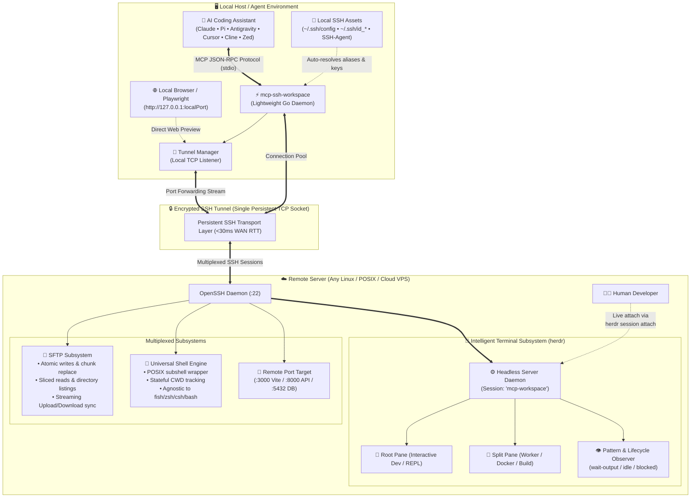

<div align="center">

# ⚡ mcp-ssh-workspace

### *The High-Performance, Agentic SSH Workspace Engine for Autonomous AI Agents*

[](LICENSE)
[](https://go.dev)
[](flake.nix)
[](https://herdr.dev)
[](https://modelcontextprotocol.io)

<p align="center">
  <b>Transform remote servers into intelligent, agentic coding environments for AI coding assistants.</b><br/>
  Persistent Herdr PTY Sessions • Spatial Multitasking • Surgical Atomic Edits • Token-Capped Line Slicing • Universal Shell Agnostic
</p>

---

[Key Features](#-why-mcp-ssh-workspace) • [Benchmarks](#-real-world-benchmarks) • [Architecture](#-architecture) • [The 23 Tools](#-the-23-agent-primitives) • [Terminal Engine Guide](#-intelligent-background-terminal-engine-herdr) • [Tool Reference](#-detailed-tool-reference--examples) • [Quickstart](#-quickstart--installation) • [NixOS Integration](#-declarative-nixos--home-manager)

---

</div>

## 💡 Why `mcp-ssh-workspace`?

Existing SSH MCP implementations treat remote machines like dumb `ssh exec` targets:
- Every command spawns a fresh shell, **discarding `cd` and environment state**.
- No PTY support: interactive tools, curses apps (`htop`, `lazygit`), and wizards **hang or crash**.
- Large files are dumped via `cat`, **instantly blowing LLM context budgets**.
- Edits rely on fragile bash `sed` or `cat << EOF` scripts that **corrupt files on quotes and escapes**.
- Remote login shells like `fish` or `csh` break naive bash command assumptions.
- Background daemons and web servers **hang the agent indefinitely**.
- Humans cannot view or attach to what the AI is running in the terminal.

**`mcp-ssh-workspace` was engineered from scratch in Go to eradicate every single one of these failure modes.**

### 📊 Feature Matrix

| Feature | Generic SSH MCP Solutions | ⚡ `mcp-ssh-workspace` |
| :--- | :--- | :--- |
| **Terminal Emulation (PTY/TUI)** | ❌ Raw pipes only: curses, TUI, `htop`, wizards crash or hang. | ✅ **Intelligent Herdr PTY:** Full terminal emulation, ANSI styling, and interactive curses support. |
| **Multitasking & Multiplexing** | ❌ None: Single serial command stream. | ✅ **Spatial Panes & Tabs:** Split panes (`right` / `down`), run parallel builds, tests, and workers. |
| **Session Persistence** | ❌ Tasks killed if connection drops or MCP restarts. | ✅ **Persistent Herdr Sessions:** Daemonized sessions survive disconnects; humans can attach live! |
| **Screen Buffer Introspection** | ❌ Dumps all stdout spam or nothing. | ✅ **Smart Viewports:** Read `visible`, `recent-unwrapped`, or `detection` buffers without token blowouts. |
| **Keystroke & Input Control** | ❌ Raw byte pipe; no interactive key dispatch. | ✅ **Key Synthesis:** Dispatch logical keys (`ctrl+c`, `esc`, `enter`, arrows) and bracketed paste text. |
| **Shell State (`cwd` & env)** | ❌ **Stateless:** Every call opens a new session. `cd /app` is lost. | ✅ **Persistent Session:** Tracks `cwd` and maintains directory context seamlessly across calls. |
| **Network Overhead** | ❌ Re-authenticates & renegotiates SSH crypto on *every* call (~1000ms). | ✅ **Multiplexed Pool:** Single long-lived SSH/SFTP connection (**<30ms** tool round-trip). |
| **File Reading** | ❌ Dumps entire files with `cat` (overflows model context tokens). | ✅ **Token-Capped Slicing:** Exact `startLine`/`endLine` ranges, line numbering, and byte caps. |
| **File Editing** | ❌ Fragile `sed` / `echo` scripts that mangle escapes and quotes. | ✅ **Surgical Replacement:** Atomic chunk find-and-replace over binary SFTP. |
| **File Synchronization** | ❌ No streaming sync; requires manual Base64 or ad-hoc `scp`. | ✅ **Streaming SFTP Sync:** High-speed `remote_upload_file` and `remote_download_file` with SHA256 integrity. |
| **Long-Running Daemons** | ❌ Blocks and times out on dev servers (`npm run dev`). | ✅ **Dual Supervision:** Herdr terminal panes **OR** classic async task supervisor. |
| **Web & API Forwarding** | ❌ Cannot view or test remote web servers locally. | ✅ **Dynamic Port Forwarding:** `remote_tunnel` binds `127.0.0.1:<port>` for browser & Playwright testing. |
| **Shell Compatibility** | ❌ Assumes standard bash; crashes if remote shell is `fish` or `csh`. | ✅ **Universal Shell Engine:** Literal subshell runner immune to remote login shell syntax (`fish`, `zsh`, `csh`, `bash`). |
| **Zero-Friction Bootstrap** | ❌ Requires manual server setup and pre-installed dependencies. | ✅ **Auto-Bootstrap:** Automatically detects and installs `herdr` on remote machine if missing. |

---

## 🔥 Real-World Benchmarks

Tested against a production server over the public internet (**Target: `amadeus@ssh.surtr.ir`, Debian GNU/Linux 6.12 x86_64, Default Remote Shell: Fish**).

```text
================================================================================
       🔥 BRUTAL STRESS TEST & BENCHMARK: mcp-ssh-workspace v1.0.0 🔥
       Engine: Herdr Persistent Terminal + Universal Shell + SFTP
       Target: amadeus@ssh.surtr.ir (Debian x86_64, Fish Shell)
================================================================================
[*] MCP Handshake:                          7.48 ms (23 tools exposed)
[*] SSH Key Exchange & SFTP Multiplexing:   287.49 ms
    Status: Successfully connected to ssh.surtr.ir. CWD: /home/amadeus
[*] Remote Host Metadata:                   42.98 ms
    Host: Linux Home 6.12.95+deb13-amd64 #1 SMP PREEMPT_DYNAMIC Debian x86_64
    Persistent CWD: /home/amadeus

[TEST 1] 🚀 High-Frequency RPC Burst (30 Sequential Echo Round-Trips)...
    ✔ Total Calls:   30 | Failures: 0
    ✔ Min Latency:   22.26 ms
    ✔ Avg Latency:   28.86 ms
    ✔ P95 Latency:   44.09 ms
    ✔ Throughput:    34.7 ops/sec over WAN!

[TEST 2] 🔬 Surgical SFTP File Editing & Token-Capped Reads...
    ✔ Atomic File Write:          20.74 ms
    ✔ Surgical Chunk Replace:     37.35 ms
    ✔ Sliced Verification Read:   20.41 ms (Integrity Confirmed)

[TEST 3] 📦 High-Volume Streaming SFTP Transfer (1 MB) & SHA256 Verification...
    ✔ Uploaded 1.00 MB in 306.33 ms (3.26 MB/s)
    ✔ Downloaded 1.00 MB in 283.73 ms (Bit-for-bit SHA256 match: ef899529238938c8...)

[TEST 4] 🧭 Stateful Working Directory (CWD) Persistence...
    ✔ Persistent CWD Preserved: /tmp/mcp_nest_a/b/c

[TEST 5] 🧠 Herdr Persistent Terminal & Spatial Multiplexing Engine...
    ✔ Herdr Runtime Snapshot:    117.87 ms (Protocol 19, Version 0.8.0)
    ✔ Command executed in root pane (w1:p1): 609.96 ms
    ✔ Split pane horizontally -> new pane ID: w1:p5 (45.80 ms)
    ✔ Parallel job executed & waited for pattern in split pane!
    ✔ Screen buffer read (27.32 ms): Output captured cleanly without ANSI garbage!
    ✔ Keystroke synthesis dispatched: Successfully sent keys [enter] (66.17 ms)
    ✔ Closed split pane cleanly (60.35 ms)

[TEST 6] 🔌 Dynamic Local-to-Remote SSH Tunnel...
    ✔ Tunnel Open: 127.0.0.1:35041 -> remote:22 (0.45 ms)
    ✔ Tunnel Closed successfully

[*] Cleanly disconnected from remote SSH host.
================================================================================
         🏆 ALL 6 STRESS TESTS & BENCHMARKS PASSED WITH 100% SUCCESS!        
================================================================================
```

---

## 🏗️ Architecture



---

## 🛠️ The 23 Agent Primitives

### 1. 🧠 Intelligent Background Terminal Engine (`herdr`)
- **`remote_terminal_run`**: Run commands inside persistent background terminal panes with real PTY and full TUI support.
- **`remote_terminal_split`**: Split terminal panes horizontally (`right`) or vertically (`down`) for concurrent multitasking.
- **`remote_terminal_read`**: Read clean terminal buffers and scrollback (`recent-unwrapped`, `visible`, or `detection`) in text or ANSI colors.
- **`remote_terminal_send_keys`**: Dispatch logical keystrokes to interactive terminal apps (`ctrl+c`, `esc`, `enter`, `up`, `down`, `q`).
- **`remote_terminal_send_text`**: Send literal text or input lines into running terminal panes with bracketed paste mode support.
- **`remote_terminal_wait`**: Block until terminal output matches a literal string or regular expression pattern.
- **`remote_terminal_list`**: Inspect full session runtime state (workspaces, tabs, panes, and running agent processes).
- **`remote_terminal_close`**: Cleanly close a terminal pane and terminate its child process.

### 2. Connection & Session Lifecycle
- **`remote_connect`**: Dynamically connect or switch between remote hosts at runtime. Auto-resolves hosts, ports, identity files, and proxies from `~/.ssh/config`.
- **`remote_disconnect`**: Cleanly terminate active SSH and SFTP channels.
- **`remote_session_info`**: Fetch remote host environment metadata (`/etc/os-release`, `uname -mrs`, active user, and persistent `cwd`).
- **`remote_set_sudo_password`**: Set or update the sudo password for privileged remote commands.

### 3. Classic Terminal & Process Supervision
- **`remote_run_command`**: Execute commands with clean `stdout`/`stderr` separation, exit code capture, persistent directory retention, and optional `terminal: true` routing.
- **`remote_manage_task`**: Manage long-running daemons, test runners, and dev servers (`action: "list" | "status" | "tail" | "kill" | "send_input"`).

### 4. Surgical SFTP File Operations & Streaming Sync
- **`remote_view_file`**: Read files with token-safe line ranges (`startLine` to `endLine`), line numbering, and byte budget protections.
- **`remote_replace_file_content`**: Surgically replace an exact code block without rewriting or risking whole-file corruption.
- **`remote_write_file`**: Atomically create or overwrite remote files with automatic recursive directory creation (`mkdir -p`).
- **`remote_upload_file`**: Stream upload local files to the remote workspace via high-speed SFTP pipeline.
- **`remote_download_file`**: Stream download remote files directly to the local filesystem with bit-for-bit integrity.
- **`remote_list_dir`**: Inspect remote directory listings with exact byte sizes, POSIX permissions, and modification timestamps.

### 5. High-Performance Code Search
- **`remote_grep_search`**: Fast regex search across the remote workspace (automatically uses `rg` if present, fallback to `grep -rn`).
- **`remote_find_by_name`**: Fast file and directory glob finding with smart dotfile matching (automatically uses `fd` if present, fallback to `find`).

### 6. Dynamic Port Forwarding & Networking
- **`remote_tunnel`**: Establish local-to-remote SSH port forwarding tunnels (`action: "open" | "close" | "list"`).

---

## 🧠 Intelligent Background Terminal Engine (`herdr`)

The `herdr` integration turns `mcp-ssh-workspace` into a full-featured terminal workspace operating system.

### 1. Execute Command with Real PTY & TUI Support
```json
{
  "name": "remote_terminal_run",
  "arguments": {
    "commandLine": "python -m http.server 8080",
    "waitMatch": "Serving HTTP on",
    "timeoutMs": 5000
  }
}
```

### 2. Spatial Multitasking: Split Panes for Concurrent Tasks
```json
// Split current pane to the right with working directory /var/www
{
  "name": "remote_terminal_split",
  "arguments": {
    "direction": "right",
    "cwd": "/var/www"
  }
}
// Returns: { "pane_id": "w1:p2", "cwd": "/var/www" }
```

### 3. Read Clean Terminal Screen Buffer Without Context Blowout
```json
{
  "name": "remote_terminal_read",
  "arguments": {
    "paneId": "w1:p2",
    "source": "recent-unwrapped",
    "lines": 50
  }
}
```

### 4. Interactive Keystrokes (e.g. Cancel Build, Navigate Menus)
```json
{
  "name": "remote_terminal_send_keys",
  "arguments": {
    "paneId": "w1:p2",
    "keys": "ctrl+c"
  }
}
```

### 5. Wait for Output Pattern Before Returning
```json
{
  "name": "remote_terminal_wait",
  "arguments": {
    "paneId": "w1:p2",
    "regex": "Compilation finished in [0-9]+ms",
    "timeoutMs": 30000
  }
}
```

### 6. Human-in-the-Loop Live Collaboration
Because `herdr` runs a persistent headless session (`mcp-workspace`) on the remote server, any human developer can attach to the exact same terminal session at any time:

```bash
# Attach live from your local terminal:
ssh -t user@remote-host "export PATH=\$HOME/.local/bin:\$PATH; herdr session attach mcp-workspace"
```

---

## 📖 Detailed Tool Reference & Examples

### 🌐 Port Forwarding: `remote_tunnel`
```json
// Open tunnel to remote Vite dev server running on port 5173
{
  "name": "remote_tunnel",
  "arguments": {
    "action": "open",
    "remotePort": 5173,
    "localPort": 0 // 0 = automatically bind an available local port
  }
}
```

### 📦 Streaming File Sync: `remote_upload_file` & `remote_download_file`
```json
// Upload local configuration to remote
{
  "name": "remote_upload_file",
  "arguments": {
    "localPath": "/home/user/app/config.json",
    "remotePath": "/var/www/app/config.json",
    "overwrite": true
  }
}
```

### 🔬 Surgical Atomic Edits: `remote_replace_file_content`
```json
{
  "name": "remote_replace_file_content",
  "arguments": {
    "targetFile": "/var/www/app/server.py",
    "targetContent": "DEBUG = True\nPORT = 8000",
    "replacementContent": "DEBUG = False\nPORT = 8080"
  }
}
```

---

## 🚀 Quickstart & Installation

### Option 1: Zero-Install via Nix (Recommended)

```bash
# Connect using an alias from ~/.ssh/config:
nix run github:surtr85/mcp-ssh-workspace -- --host my-vps

# Or specify user and host directly:
nix run github:surtr85/mcp-ssh-workspace -- --host 192.168.1.50 --user ubuntu

# Or start in Dynamic Mode (let the AI agent connect when needed):
nix run github:surtr85/mcp-ssh-workspace
```

### Option 2: Build from Source

```bash
git clone https://github.com/surtr85/mcp-ssh-workspace.git
cd mcp-ssh-workspace
nix build
./result/bin/mcp-ssh-workspace --help
```

---

## ❄️ Declarative NixOS & Home-Manager

Add to your `home-manager` MCP configuration:

```nix
{
  mcpServers = {
    ssh-workspace = {
      command = "${pkgs.mcp-ssh-workspace}/bin/mcp-ssh-workspace";
    };
  };
}
```

---

<div align="center">
  <b>Engineered with precision for autonomous AI agents.</b><br/>
  MIT Licensed • Designed by <a href="https://github.com/surtr85">surtr85</a>
</div>
